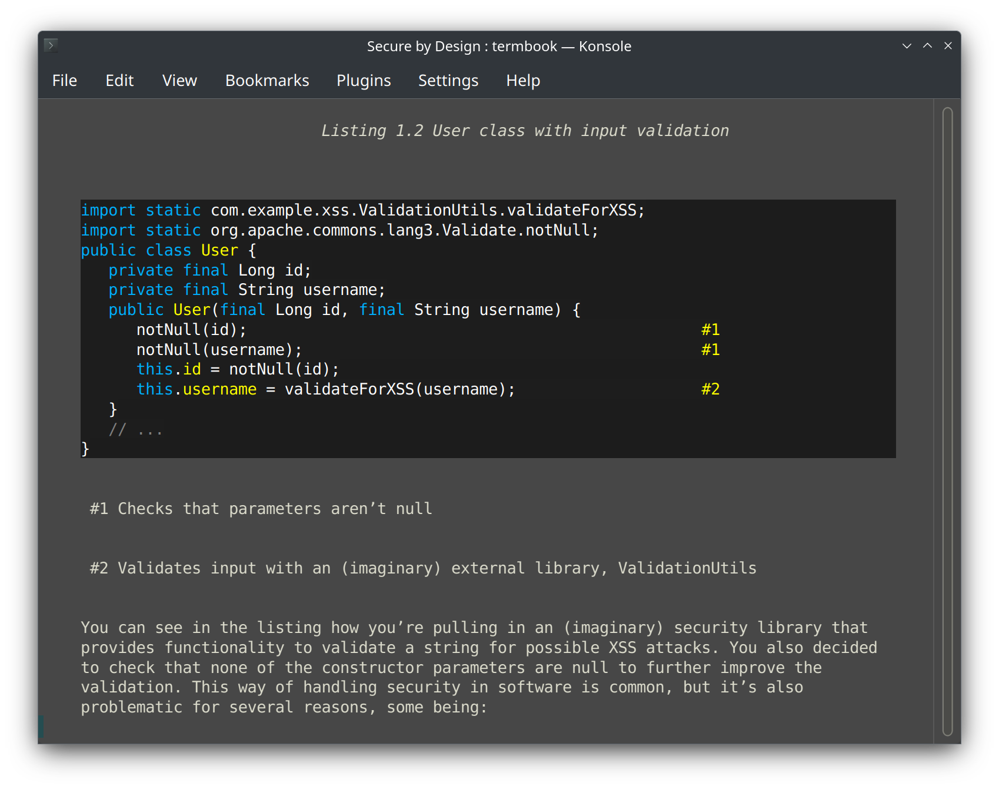

# termbook

A terminal-based EPUB reader optimized for programming books, with inline 256-color image rendering and syntax-highlighted code blocks.



## About

termbook is a derivative of [epr (epub-reader)](https://github.com/wustho/epr) by Benawi Adha, enhanced with features specifically designed for reading technical and programming books in the terminal.

### Key Features

- **256-color inline image rendering** - View diagrams, charts, and illustrations directly in your terminal
- **Syntax-highlighted code blocks** - Automatic language detection and highlighting for code snippets
- **Full EPUB support** - Read any standard EPUB file
- **Curses-based interface** - Clean, distraction-free reading experience
- **Simple keybindings** - Easy navigation with arrow keys and common shortcuts  
- **Reading history** - Track your reading progress across sessions
- **Global bookmarks** - Save and annotate positions across all books
- **Search functionality** - Find text within your books
- **Table of Contents navigation** - Quick chapter jumping
- **Dynamic terminal resize** - Automatically adapts text width when terminal is resized

## Attribution

This project is based on **epr (epub-reader)** by Benawi Adha:
- Original repository: https://github.com/wustho/epr
- License: MIT
- Author: Benawi Adha (benawiadha@gmail.com)

The core EPUB reading functionality, curses interface, and navigation system are from the original epr project. Enhancements for image rendering and code highlighting were added by Lee Hanken.

## Requirements

### System Dependencies
- Python 3.8 or higher
- Terminal with 256-color support
- Linux (primary target, may work on other Unix-like systems)

### Python Dependencies
- `Pillow` (PIL) - For image processing and rendering
- `pygments` - For syntax highlighting of code blocks

## Installation

### Recommended: Automated Installation

**Prerequisites:**
- Python 3.8 or higher
- Terminal with 256-color support
- Git

**Quick Installation:**

```bash
# 1. Clone the repository
git clone https://github.com/macsplit/termbook.git
cd termbook

# 2. Choose your installation method:

# Option A: Local installation (no sudo required) - installs to ~/.local/bin
make install-local

# Option B: System-wide installation (requires sudo) - installs to /usr/local/bin
make install
```

That's it! The installation scripts will automatically:
- Create and manage a virtual environment
- Install all dependencies
- Build and install termbook
- Create a global `termbook` command

**Using Make alternatives:**
```bash
# If you don't have make, run the scripts directly:
./install_local.sh    # For local installation
./install.sh          # For system-wide installation (requires sudo)
```

**Usage after installation:**
```bash
# Read an EPUB file
termbook path/to/your/book.epub

# Show help
termbook --help

# For local install, ensure ~/.local/bin is in your PATH
# Add to ~/.bashrc or ~/.zshrc if needed:
export PATH="$HOME/.local/bin:$PATH"
```

### Manual Installation (Advanced Users)

If you prefer manual control over the installation process:

```bash
# 1. Clone the repository
git clone https://github.com/macsplit/termbook.git
cd termbook

# 2. Create and activate virtual environment
python3 -m venv venv
source venv/bin/activate

# 3. Install dependencies and termbook
pip install --upgrade pip setuptools wheel
pip install -r requirements.txt
pip install -e .

# 4. Create wrapper script (choose location)
# For local install (~/.local/bin):
mkdir -p ~/.local/bin
cp termbook_wrapper.sh ~/.local/bin/termbook
chmod +x ~/.local/bin/termbook

# For system-wide install (/usr/local/bin):
sudo cp termbook_wrapper.sh /usr/local/bin/termbook
sudo chmod +x /usr/local/bin/termbook
```

### Package Manager Installation

Currently not available through package managers. Please use the automated installation method above.

### Uninstalling

To remove termbook:

```bash
# Using make
make uninstall

# Or run the uninstall script directly
./uninstall.sh
```

This will remove:
- The global `termbook` command
- The virtual environment
- All build artifacts

Your reading history and bookmarks are stored in `~/.termbook` and are not removed during uninstallation.

## Usage

```bash
# Read an EPUB file
termbook book.epub

# Read last opened book
termbook

# Show reading history
termbook -r

# Search history for a book
termbook "python programming"

# Dump EPUB contents as plain text
termbook -d book.epub

# Show help
termbook --help
```

## Key Bindings

| Key | Action |
|-----|--------|
| `?` | Show help |
| `q` | Quit |
| `↓` | Scroll down |
| `↑` | Scroll up |
| `Space`, `PgDn`, `→` | Next page |
| `PgUp`, `←` | Previous page |
| `n` | Next chapter |
| `p` | Previous chapter |
| `Home` | Beginning of chapter |
| `End` | End of chapter |
| `i` | Open image in viewer |
| `u` | Open URLs |
| `/` | Search |
| `n` | Next search result (during search) |
| `p` | Previous search result (during search) |
| `Tab`, `t` | Table of contents |
| `m` | Show metadata |
| `s` | Save bookmark with annotation |
| `b` | Show saved bookmarks |
| `c` | Cycle color schemes |

## Color Schemes

termbook includes three color schemes:
- **Default**: Terminal default colors
- **Dark**: Dark theme optimized for dark terminals  
- **Light**: Light theme optimized for light terminals

Press `c` while reading to cycle through themes.

## Terminal Configuration

For best results, ensure your terminal:
- Supports 256 colors (most modern terminals do)
- Has a monospace font with good Unicode support
- Has sufficient width (80+ columns recommended)

### Testing 256-color support:
```bash
# Check if your terminal supports 256 colors
tput colors
# Should output: 256

# Or check TERM variable
echo $TERM
# Should contain "256color"
```

## Troubleshooting

### Images not displaying correctly
- Ensure your terminal supports 256 colors
- Try adjusting terminal font size
- Check that Pillow is properly installed: `python -c "from PIL import Image; print('OK')"`

### Code highlighting not working
- Install pygments: `pip install pygments`
- Check pygments is working: `python -c "import pygments; print('OK')"`

### Unicode/special characters not displaying
- Ensure your terminal uses UTF-8 encoding
- Try a different terminal font with better Unicode support

## Contributing

Contributions are welcome! Please feel free to submit issues or pull requests.

## License

This project maintains the MIT License from the original epr project.

MIT License - see LICENSE file for details.

## Author

**termbook enhancements**: Lee Hanken

**Original epr**: Benawi Adha (benawiadha@gmail.com)

## Acknowledgments

Special thanks to Benawi Adha for creating the excellent epr epub reader that serves as the foundation for this project.